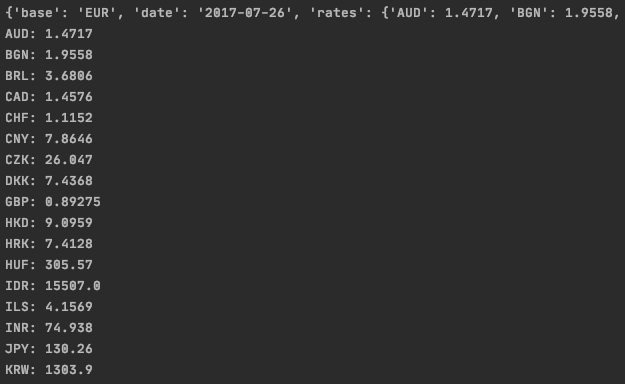

# Task - JSON Currency Exchange

### Tasks
1. Copy the json file containing the exchange rates into your own project and repo.
2. Display all the data from the json file.
3. Iterate through the data and display exchange rate by country.

### Acceptance Criteria:
* Create a new repo
* Create a new project 
* Create a file to write tests 
* Create a file to write code
* Implement pseudo coding
* Create a README documenting the steps to successfully achieve the task.

# Guide
### Setup
1. Create a new project in PyCharm and a new repository on GitHub.
2. Within the project, create a [.gitignore](.gitignore) file to ignore irrelevant files.
    ```
    venv/
    /.idea/
    ```
3. Create a README.md file for documentation of the task.
4. Create a suitably named .json file, ensuring to adhere to good naming convention.
5. Create a suitably named .py file, ensuring to adhere to good naming convention. 
4. Initialise the empty repository by following the commands listed on GitHub. For reference:
    ```
   git init
   git add .
   git commit -m "logical comment"
   git branch -M main
   git remote add origin <link to repository on GitHub>
   git push -u origin main 
   ```
   
### Code
With the setup complete, the tasks can be addressed.
1. Copy the exchange rate data into the **.json** file 
2. Navigate to the .py file.
3. Import the relevant libraries in this case, ```json```.
    ```python
    import json
    ``` 
4. Access the json file containing the exchange rates using ```with open("file_name")``` Using the ```as``` keyword creates an alias which allows the file to be accessed easier. 
    ```python
    with open("exchange_rates.json") as jsonrates:
    ```
5. Use the load method to copy the data in the json file and store as a variable.
    ```python
    exchange_rates=json.load(jsonrates)
    ```
6. Print the ```exchange_rates``` variable to view the contents of the .json file.
    ```python
    print(exchange_rates)
    ```
7. Create a for loop to iterate through the nested dictionary, 'rates'. # Print the items of this dictionary, as formatted strings.
    ```python
       for x,y in exchange_rates['rates'].items():
            print("{}: {}".format(x,y))
    ```
   
8. Run the file. This can be done by pressing ctrl+click on the page and naviagting to the run command. 

### Output
The output should consist of a dictionary with the contents of he json file. This will be followed by a list of each country and its corresponding exchange rate, separated by a colon.
The image below shows a small snapshot of the output. 
